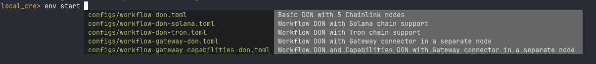

# Local CRE environment

## Contact Us
Slack: #topic-local-dev-environments

## Table of content

1. [Using the CLI](#using-the-cli)
   - [Prerequisites](#prerequisites-for-docker)
   - [Setup](#setup)
   - [Start Environment](#start-environment)
    - [Using Existing Docker plugins image](#using-existing-docker-plugins-image)
    - [Beholder](#beholder)
    - [Storage](#storage)
   - [Stop Environment](#stop-environment)
   - [Restart Environment](#restarting-the-environment)
   - [DX Tracing](#dx-tracing)
2. [Job Distributor Image](#job-distributor-image)
3. [Example Workflows](#example-workflows)
3. [Adding a New Standard Capability](#adding-a-new-standard-capability)
    - [Capability Types](#capability-types)
    - [Step 1: Define the Capability Flag](#step-1-define-the-capability-flag)
    - [Step 2: Create the Capability Implementation](#step-2-create-the-capability-implementation)
    - [Step 3: Optional Gateway Handler Configuration](#step-3-optional-gateway-handler-configuration)
    - [Step 4: Optional Node Configuration Modifications](#step-4-optional-node-configuration-modifications)
    - [Step 5: Add Default Configuration](#step-5-add-default-configuration)
    - [Step 6: Register the Capability](#step-6-register-the-capability)
    - [Step 7: Add to Environment Configurations](#step-7-add-to-environment-configurations)
    - [Configuration Templates](#configuration-templates)
    - [Important Notes](#important-notes)
5. [Multiple DONs](#multiple-dons)
    - [Supported Capabilities](#supported-capabilities)
    - [DON-level Capabilities](#don-level-capabilities)
    - [Chain-level Capabilities](#chain-level-capabilities)
    - [DON Types](#don-types)
    - [TOML Configuration Structure](#toml-configuration-structure)
    - [Example: Adding a New Topology](#example-adding-a-new-topology)
    - [Configuration Modes](#configuration-modes)
    - [Port Management](#port-management)
    - [Important Notes](#important-notes)
6. [Enabling Already Implemented Capabilities](#enabling-already-implemented-capabilities)
    - [Available Configuration Files](#available-configuration-files)
    - [Capability Types and Configuration](#capability-types-and-configuration)
    - [DON-level Capabilities](#don-level-capabilities-1)
    - [Chain-level Capabilities](#chain-level-capabilities-1)
    - [Binary Requirements](#binary-requirements)
    - [Enabling Capabilities in Your Topology](#enabling-capabilities-in-your-topology)
    - [Configuration Examples](#configuration-examples)
    - [Custom Capability Configuration](#custom-capability-configuration)
    - [Important Notes](#important-notes-1)
    - [Troubleshooting Capability Issues](#troubleshooting-capability-issues)
7. [Binary Location and Naming](#binary-location-and-naming)
8. [Hot swapping](#hot-swapping)
9. [Telemetry Configuration](#telemetry-configuration)
10. [Troubleshooting](#troubleshooting)

# Using the CLI

The CLI manages CRE test environments. It is located in `core/scripts/cre/environment`. It doesn't come as a compiled binary, so every command has to be executed as `go run . <command> [subcommand]` (although check below!).

## Installing the binary
You can compile and install the binary by running:
```shell
cd core/scripts/cre/environment
make install
```

It will compile local CRE as `local_cre`. With it installed you will be able to access interactive shell **with autocompletions** by running `local_cre sh`. Without installing the binary interactive shell won't be available.



> Warning: Control+C won't interrupt commands executed via the interactive shell.

## Prerequisites (for Docker) ###
1. **Docker installed and running**
    - with usage of default Docker socket **enabled**
    - with Apple Virtualization framework **enabled**
    - with VirtioFS **enabled**
    - with use of containerd for pulling and storing images **disabled**
2. **AWS SSO access to SDLC**
  - REQUIRED: `sdlc` profile (with `PowerUserAccess` role)
>  [See more for configuring AWS in CLL](https://smartcontract-it.atlassian.net/wiki/spaces/INFRA/pages/1045495923/Configure+the+AWS+CLI)


## Prerequisites For CRIB ###
1. telepresence installed: `brew install telepresenceio/telepresence/telepresence-oss`
2. Telepresence will update the /etc/resolver configs and will require to enter sudo password the first time you run it

# QUICKSTART
```
# e.g. AWS_ECR=<PROD_ACCOUNT_ID>.dkr.ecr.<REGION>.amazonaws.com
AWS_ECR=<PROD_AWS_URL> go run . env start --auto-setup
```
> You can find `PROD_ACCOUNT_ID` and `REGION` in the `[profile prod]` section of the [AWS CLI configuration guide](https://smartcontract-it.atlassian.net/wiki/spaces/INFRA/pages/1045495923/Configure+the+AWS+CLI#Configure).

If you are missing requirements, you may need to fix the errors and re-run.

Refer to [this document](https://docs.google.com/document/d/1HtVLv2ipx2jvU15WYOijQ-R-5BIZrTdAaumlquQVZ48/edit?tab=t.0#heading=h.wqgcsrk9ncjs) for troubleshooting and FAQ. Use `#topic-local-dev-environments` for help.

## Setup

Environment can be setup by running `go run . env setup` inside `fdf` folder. Its configuration is defined in [configs/setup.toml](configs/setup.toml) file. It will make sure that:
- you have AWS CLI installed and configured
- you have GH CLI installed and authenticated
- you have required Job Distributor and Chip Ingress (Beholder) images
- build and copy all capability binaries to expected location

## Start Environment
```bash
# while in core/scripts/cre/environment
go run . env start [--auto-setup]

# to start environment with an example workflow web API-based workflow
go run . env start --with-example

 # to start environment with an example workflow cron-based workflow (this requires the `cron` capability binary present in `/binaries` folder)
go run . env start --with-example --example-workflow-trigger cron

# to start environment using image with all supported capabilities
go run . env start --with-plugins-docker-image <SDLC_ACCOUNT_ID>dkr.ecr.<SDLC_ACCOUNT_REGION>.amazonaws.com/chainlink:nightly-<YYYMMDD>-plugins

# to start environment with local Beholder
go run . env start --with-beholder
```

> Important! **Nightly** Chainlink images are retained only for one day and built at 03:00 UTC. That means that in most cases you should use today's image, not yesterday's.

Optional parameters:
- `-a`: Check if all dependencies are present and if not install them (defaults to `false`)
- `-t`: Topology (`simplified` or `full`)
- `-w`: Wait on error before removing up Docker containers (e.g. to inspect Docker logs, e.g. `-w 5m`)
- `-e`: Extra ports for which external access by the DON should be allowed (e.g. when making API calls or downloading WASM workflows)
- `-x`: Registers an example PoR workflow using CRE CLI and verifies it executed successfuly
- `-s`: Time to wait for example workflow to execute successfuly (defaults to `5m`)
- `-p`: Docker `plugins` image to use (must contain all of the following capabilities: `ocr3`, `cron`, `readcontract` and `logevent`)
- `-y`: Trigger for example workflow to deploy (web-trigger or cron). Default: `web-trigger`. **Important!** `cron` trigger requires user to either provide the capbility binary path in TOML config or Docker image that has it baked in
- `-c`: List of configuration files for `.proto` files that will be registered in Beholder (only if `--with-beholder/-b` flag is used). Defaults to [./proto-configs/default.toml](./proto-configs/default.toml)

## Purging environment state
To remove all state and cache files used by the environment execute:
```bash
# while in core/scripts/cre/environment
go run . env state purge
```

This might be helpful if you suspect that state files might be corrupt and you're unable to start the environment.

### Using existing Docker Plugins image

If you don't want to build Chainlink image from your local branch (default behaviour) or you don't want to go through the hassle of downloading capabilities binaries in order to enable them on your environment you should use the `--with-plugins-docker-image` flag. It is recommended to use a nightly `core plugins` image that's build by [Docker Build action](https://github.com/smartcontractkit/chainlink/actions/workflows/docker-build.yml) as it contains all supported capability binaries.

### Beholder

When environment is started with `--with-beholder` or with `-b` flag after the DON is ready  we will boot up `Chip Ingress` and `Red Panda`, create a `cre` topic and download and install workflow-related protobufs from the [chainlink-protos](https://github.com/smartcontractkit/chainlink-protos/tree/main/workflows) repository.

Once up and running you will be able to access [CRE topic view](http://localhost:8080/topics/cre) to see workflow-emitted events. These include both standard events emitted by the Workflow Engine and custom events emitted from your workflow.

#### Filtering out heartbeats
Heartbeat messages spam the topic, so it's highly recommended that you add a JavaScript filter that will exclude them using the following code: `return value.msg !== 'heartbeat';`.

If environment is aready running you can start just the Beholder stack (and register protos) with:
```bash
go run . env beholder start
```

> This assumes you have `chip-ingress:bbac3c825b061546980fa9d7dc0f3e8c34347bcf` Docker image on your local machine. Without it Beholder won't be able to start. If you do not, close the [Atlas](https://github.com/smartcontractkit/atlas) repository, and then in `atlas/chip-ingress` run `docker build -t chip-ingress:bbac3c825b061546980fa9d7dc0f3e8c34347bcf .`

### Storage

By default, workflow artifacts are loaded from the container's filesystem. The Chainlink nodes can only load workflow files from the local filesystem if `WorkflowFetcher` uses the `file://` prefix. Right now, it cannot read workflow files from both the local filesystem and external sources (like S3 or web servers) at the same time.

The environment supports two storage backends for workflow uploads:
- Gist (requires deprecated CRE CLI, remote)
- S3 MinIO (built-in, local)

Configuration details for the CRE CLI are generated automatically into the `cre.yaml` file
(path is printed after starting the environment).

For more details on the URL resolution process and how workflow artifacts are handled, see the [URL Resolution Process](../../../../system-tests/tests/smoke/cre/guidelines.md#url-resolution-process) section in `system-tests/tests/smoke/cre/guidelines.md`.

## Stop Environment
```bash
# while in core/scripts/cre/environment
go run main.go env stop

# or... if you have the CTF binary
ctf d rm
```
---

## Restarting the environment

If you are using Blockscout and you restart the environment **you need to restart the block explorer** if you want to see current block history. If you don't you will see stale state of the previous environment. To restart execute:
```bash
ctf bs r
```
---

## Debugging core nodes
Before start the environment set the `CTF_CLNODE_DLV` environment variable to `true`
```bash
export CTF_CLNODE_DLV="true"
```
Nodes will open a Delve server on port `40000 + node index` (e.g. first node will be on `40000`, second on `40001` etc). You can connect to it using your IDE or `dlv` CLI.

## Debugging capabilities (mac)
Build the capability with the following flags (this ensures that the binary is not run using rosetta as this prevents dlv from attaching)
```bash
GOOS=linux GOARCH=arm64 go build -gcflags "all=-N -l" -o <capability binary name>
```
Copy the capability binary to `core/scripts/cre/environment/binaries` folder.

Add or update the `custom_ports` entry in the topology file (e.g., `core/scripts/cre/environment/configs/workflow-don.toml`) to include the port mapping for the Delve debugger. For example:
```toml
custom_ports = ["5002:5002", "15002:15002", "45000:45000"]
```

Start the environment and verify that the container is exposing the new port.  Start a shell session on the relevant container, e.g:
```bash
docker exec -it workflow-node1 /bin/bash
```

In the shell session list all processes (`ps -aux`) and identify the PID of the capability you want to debug.  Also, verify
that rosetta is not being used to run the capability binary that you want to debug.

Attach dlv to the capability process using the PID you identified above, e.g:
```bash
dlv attach <PID> --headless --listen=:45000 --api-version=2 --accept-multiclient
```

Attach your IDE to the dlv server on port `45000` (or whatever port you exposed).


## Workflow Commands

The environment provides workflow management commands defined in `core/scripts/cre/environment/environment/workflow.go`:

### `workflow deploy`
Compiles and uploads a workflow to the environment by copying it to workflow nodes and registering with the workflow registry. It checks if a workflow with same name already exists and deletes it, if it does.

**Usage:**
```bash
go run . workflow deploy [flags]
```

**Key flags:**
- `-w, --workflow-file-path`: Path to the workflow file (default: `./examples/workflows/v2/cron/main.go`)
- `-c, --config-file-path`: Path to the config file (optional)
- `-s, --secrets-file-path`: Path to the secrets file (optional)
- `-t, --container-target-dir`: Path to target directory in Docker container (default: `/home/chainlink/workflows`)
- `-o, --container-name-pattern`: Pattern to match container name (default: `workflow-node`)
- `-n, --workflow-name`: Workflow name (default: `exampleworkflow`)
- `-r, --rpc-url`: RPC URL (default: `http://localhost:8545`)
- `-i, --chain-id`: Chain ID (default: `1337`)
- `-a, --workflow-registry-address`: Workflow registry address (default: `0x9fE46736679d2D9a65F0992F2272dE9f3c7fa6e0`)
- `-b, --capabilities-registry-address`: Capabilities registry address (default: `0xe7f1725E7734CE288F8367e1Bb143E90bb3F0512`)
- `-d, --workflow-owner-address`: Workflow owner address (default: `0xf39fd6e51aad88f6f4ce6ab8827279cfffb92266`)
- `-e, --don-id`: DON ID (default: `1`)

**Example:**
```bash
go run . workflow deploy -w ./my-workflow.go -n myworkflow -c ./config.yaml
```

### `workflow delete`
Deletes a specific workflow from the workflow registry contract (but doesn't remove it from Docker containers).

**Usage:**
```bash
go run . workflow delete [flags]
```

**Key flags:**
- `-n, --name`: Workflow name to delete (default: `exampleworkflow`)
- `-r, --rpc-url`: RPC URL (default: `http://localhost:8545`)
- `-i, --chain-id`: Chain ID (default: `1337`)
- `-a, --workflow-registry-address`: Workflow registry address (default: `0x9fE46736679d2D9a65F0992F2272dE9f3c7fa6e0`)
- `-d, --workflow-owner-address`: Workflow owner address (default: `0xf39fd6e51aad88f6f4ce6ab8827279cfffb92266`)

**Example:**
```bash
go run . workflow delete -n myworkflow
```

### `workflow delete-all`
Deletes all workflows from the workflow registry contract.

**Usage:**
```bash
go run . workflow delete-all [flags]
```

**Key flags:**
- `-r, --rpc-url`: RPC URL (default: `http://localhost:8545`)
- `-i, --chain-id`: Chain ID (default: `1337`)
- `-a, --workflow-registry-address`: Workflow registry address (default: `0x9fE46736679d2D9a65F0992F2272dE9f3c7fa6e0`)
- `-d, --workflow-owner-address`: Workflow owner address (default: `0xf39fd6e51aad88f6f4ce6ab8827279cfffb92266`)

**Example:**
```bash
go run . workflow delete-all
```

### `workflow deploy-and-verify-example`
Deploys and verifies the example workflow.

**Usage:**
```bash
go run . workflow deploy-and-verify-example
```

This command uses default values and is useful for testing the workflow deployment process.

---

## Further use
To manage workflows you will need the CRE CLI. You can either:
- download it from [smartcontract/dev-platform](https://github.com/smartcontractkit/dev-platform/releases/tag/v0.2.0) or
- using GH CLI:
  ```bash
  gh release download v0.2.0 --repo smartcontractkit/dev-platform --pattern '*darwin_arm64*'
  ```

Remember that the CRE CLI version needs to match your CPU architecture and operating system.

---

### Advanced Usage:
1. **Choose the Right Topology**
   - For a single DON with all capabilities: `configs/workflow-don.toml` (default)
   - For a single DON with all capabilities, but with a separate gateway node: `configs/workflow-gateway-don.toml`
   - For a full topology (workflow DON + capabilities DON + gateway DON): `configs/workflow-gateway-capabilities-don.toml`
2. **Download or Build Capability Binaries**
   - Some capabilities like `cron`, `log-event-trigger`, or `read-contract` are not embedded in all Chainlink images.
   - If your use case requires them, you should build them manually by:
      - Cloning [smartcontractkit/capabilities](https://github.com/smartcontractkit/capabilities) repository (Make sure they are built for `linux/amd64`!)
      - Building each capability manually by running `GOOS="linux" GOARCH="amd64" CGO_ENABLED=0 go build -o evm` inside capability's folder or building all of them at once with `./nx run-many -t build` in root of `capabilities` folder

     **Once that is done copy them to `core/scripts/cre/environment/binaries` folder.**  Each binary will be copied to the Docker image (if the DON has that capability enabled).
   - If the capability is already baked into your CL image (check the Dockerfile), comment out the TOML path line to skip copying. (they will be commented out by default)
3.  **Decide whether to build or reuse Chainlink Docker Image**
     - By default, the config builds the Docker image from your local branch. To use an existing image change to:
     ```toml
     [nodesets.node_specs.node]
     image = "<your-Docker-image>:<your-tag>"
     ```
      - Make these changes for **all** nodes in the nodeset in the TOML config.
      - If you decide to reuse a Chainlink Docker Image using the `--with-plugins-docker-image` flag, please notice that this will not copy any capability binaries to the image.
        You will need to make sure that all the capabilities you need are baked in the image you are using.

4. **Decide whether to use Docker or k8s**
    - Read [Docker vs Kubernetes in guidelines.md](../../../../system-tests/tests/smoke/cre/guidelines.md) to learn how to switch between Docker and Kubernetes
5. **Start Observability Stack (Docker-only)**
      ```bash
      # to start Loki, Grafana and Prometheus run:
      ctf obs up

     # to start Blockscout block explorer run:
      ctf bs u
      ```
    - To download the `ctf` binary follow the steps described [here](https://smartcontractkit.github.io/chainlink-testing-framework/framework/getting_started.html)

Optional environment variables used by the CLI:
- `CTF_CONFIGS`: TOML config paths. Defaults to [./configs/workflow-don.toml](./configs/workflow-don.toml)
- `PRIVATE_KEY`: Plaintext private key that will be used for all deployments (needs to be funded). Defaults to `ac0974bec39a17e36ba4a6b4d238ff944bacb478cbed5efcae784d7bf4f2ff80`
- `TESTCONTAINERS_RYUK_DISABLED`: Set to "true" to disable cleanup. Defaults to `false`

When starting the environment in AWS-managed Kubernetes make sure to source `.env` environment from the `crib/deployments/cre` folder specific for AWS. Remember, that it must include ingress domain settings.

### Testing Billing
Spin up the billing service and necessary migrations in the `billing-platform-service` repo.
The directions there should be sufficient. If they are not, give a shout to @cre-business.

So far, all we have working is the workflow run by:
```go
go run . env start --with-example -w 1m
```

I recommend increasing your docker resources to near max memory, as this is going to slow your local
machine down anyways, and it could mean the difference between a 5 minute and 2 minute iteration cycle.

Add the following TOML config to `core/scripts/cre/environment/configs/workflow-don.toml`:
```toml
[Billing]
URL = 'host.docker.internal:2223'
TLSEnabled = false
```

Outside of the local-CRE, the workflow registry chain ID and address is pulled from
[Capabilities.WorkflowRegistry]. We don't yet have that figured out in the local-CRE
(it will spin up relayers), so instead you want to mimic the following diffs:

```go
@@ -535,7 +537,8 @@ func NewApplication(ctx context.Context, opts ApplicationOpts) (Application, err
                creServices.workflowRateLimiter,
                creServices.workflowLimits,
                workflows.WithBillingClient(billingClient),
-               workflows.WithWorkflowRegistry(cfg.Capabilities().WorkflowRegistry().Address(), cfg.Capabilities().WorkflowReg
istry().ChainID()),
+               // tmp to avoid booting up relayers
+               workflows.WithWorkflowRegistry("0xA15BB66138824a1c7167f5E85b957d04Dd34E468", "11155111"),
```

and

```
@@ -957,7 +960,7 @@ func newCREServices(
                                        workflowLimits,
                                        artifactsStore,
                                        syncer.WithBillingClient(billingClient),
-                                       syncer.WithWorkflowRegistry(capCfg.WorkflowRegistry().Address(), capCfg.WorkflowRegist
ry().ChainID()),
+                                       syncer.WithWorkflowRegistry("0xA15BB66138824a1c7167f5E85b957d04Dd34E468", "11155111"),
                                )
```

The happy-path:
* workflow runs successfully
* no `switch to metering mode` error logs generated by the workflow run
* SubmitWorkflowReceipt in billing service does not have an err message

---

## DX Tracing

To track environment usage and quality metrics (success/failure rate, startup time) local CRE environment is integrated with DX. If you have `gh cli` configured and authenticated on your local machine it will be used to automatically setup DX integration in the background. If you don't, tracing data will be stored locally in `~/.local/share/dx/` and uploaded once either `gh cli` is available or valid `~/.local/share/dx/config.json` file appears.

> Minimum required version of the `GH CLI` is `v2.50.0`

To opt out from tracing use the following environment variable:
```bash
DISABLE_DX_TRACKING=true
```

### Manually creating config file

Valid config file has the following content:
```json
{
  "dx_api_token":"xxx",
  "github_username":"your-gh-username"
}
```

DX API token can be found in 1 Password in the engineering vault as `DX - Local CRE Environment`.

Other environment variables:
* `DX_LOG_LEVEL` -- log level of a rudimentary logger
* `DX_TEST_MODE` -- executes in test mode, which means that data sent to DX won't be included in any reports
* `DX_FORCE_OFFLINE_MODE` -- doesn't send any events, instead saves them on the disk

---

# Job Distributor Image

Tests require a local Job Distributor image. By default, configs expect version `job-distributor:0.22.1`.

To build locally:
```bash
git clone https://github.com/smartcontractkit/job-distributor
cd job-distributor
git checkout v0.22.1
docker build -t job-distributor:0.22.1 -f e2e/Dockerfile.e2e .
```

If you pull the image from the PRO ECR remember to either update the image name in [TOML config](./configs/) for your chosed topology or to tag that image as `job-distributor:0.22.1`.

## Example Workflows

The environment includes several example workflows located in `core/scripts/cre/environment/examples/workflows/`:

### Available Workflows

#### V2 Workflows
- **`v2/cron/`**: Simple cron-based workflow that executes on a schedule
- **`v2/node-mode/`**: Node mode workflow example
- **`v2/http/`**: HTTP-based workflow example

#### V1 Workflows
- **`v1/proof-of-reserve/cron-based/`**: Cron-based proof-of-reserve workflow
- **`v1/proof-of-reserve/web-trigger-based/`**: Web API trigger-based proof-of-reserve workflow

### Deployable Example Workflows

The following workflows can be deployed using the `workflow deploy-and-verify-example` command:

#### Proof-of-Reserve Workflows
Both proof-of-reserve workflows execute a proof-of-reserve-like scenario with the following steps:
- Call external HTTP API and fetch value of test asset
- Reach consensus on that value
- Write that value in the consumer contract on chain

**Usage:**
```bash
go run . workflow deploy-and-verify-example [flags]
```

**Key flags:**
- `-y, --example-workflow-trigger`: Trigger type (`web-trigger` or `cron`, default: `web-trigger`)
- `-u, --example-workflow-timeout`: Time to wait for workflow execution (default: `5m`)
- `-g, --gateway-url`: Gateway URL for web API trigger (default: `http://localhost:5002`)
- `-d, --don-id`: DON ID for web API trigger (default: `vault`)
- `-w, --workflow-registry-address`: Workflow registry address (default: `0x9fE46736679d2D9a65F0992F2272dE9f3c7fa6e0`)
- `-r, --rpc-url`: RPC URL (default: `http://localhost:8545`)

**Examples:**
```bash
# Deploy cron-based proof-of-reserve workflow
go run . workflow deploy-and-verify-example -y cron

# Deploy web-trigger-based proof-of-reserve workflow with custom timeout
go run . workflow deploy-and-verify-example -y web-trigger -u 10m
```

#### Cron-based Workflow
- **Trigger**: Every 30 seconds on a schedule
- **Behavior**: Keeps executing until paused or deleted
- **Requirements**: External `cron` capability binary (must be manually compiled or downloaded and configured in TOML)
- **Source**: [`examples/workflows/v1/proof-of-reserve/cron-based/main.go`](./examples/workflows/v1/proof-of-reserve/cron-based/main.go)

#### Web API Trigger-based Workflow
- **Trigger**: Only when a precisely crafted and cryptographically signed request is made to the gateway node
- **Behavior**: Triggers workflow **once** and only if:
  - Sender is whitelisted in the workflow
  - Topic is whitelisted in the workflow
- **Source**: [`examples/workflows/v1/proof-of-reserve/web-trigger-based/main.go`](./examples/workflows/v1/proof-of-reserve/web-trigger-based/main.go)

**Note**: You might see multiple attempts to trigger and verify the workflow when running the example. This is expected and could happen because:
- Topic hasn't been registered yet (nodes haven't downloaded the workflow yet)
- Consensus wasn't reached in time

### Manual Workflow Deployment

For other workflows (v2/cron, v2/node-mode, v2/http), you can deploy them manually using the `workflow deploy` command:

```bash
# Deploy v2 cron workflow
go run . workflow deploy -w ./examples/workflows/v2/cron/main.go -n cron-workflow

# Deploy v2 http workflow
go run . workflow deploy -w ./examples/workflows/v2/http/main.go -n http-workflow

# Deploy v2 node-mode workflow
go run . workflow deploy -w ./examples/workflows/v2/node-mode/main.go -n node-mode-workflow
```


## Adding a New Standard Capability

This section explains how to add new standard capabilities to the CRE test framework. There are two types of capabilities:

- **DON-level capabilities**: Run once per DON (e.g., cron triggers, HTTP actions)
- **Chain-level capabilities**: Run per chain (e.g., read contract, write EVM)

### Capability Types

**DON-level capabilities** are used when:
- The capability operates at the DON level (not chain-specific)
- Examples: cron triggers, HTTP actions, random number generators
- Configuration is shared across all nodes in the DON

**Chain-level capabilities** are used when:
- The capability needs to interact with specific blockchain networks
- Examples: read contract, write EVM
- Configuration varies per chain (different RPC URLs, chain IDs, etc.)

### Step 1: Define the Capability Flag

Add a unique flag in `system-tests/lib/cre/types.go`:

```go
const (
    // ... existing capabilities ...
    RandomNumberGeneratorCapability CapabilityFlag = "random-number-generator" // DON-level example
    GasEstimatorCapability          CapabilityFlag = "gas-estimator"          // Chain-level example
)
```

### Step 2: Create the Capability Implementation

Create a new directory in `system-tests/lib/cre/capabilities/` with your capability name.

#### DON-level Capability Example (Random Number Generator)

```go
// system-tests/lib/cre/capabilities/randomnumbergenerator/random_number_generator.go
package randomnumbergenerator

import (
    capabilitiespb "github.com/smartcontractkit/chainlink-common/pkg/capabilities/pb"
    kcr "github.com/smartcontractkit/chainlink-evm/gethwrappers/keystone/generated/capabilities_registry_1_1_0"
    keystone_changeset "github.com/smartcontractkit/chainlink/deployment/keystone/changeset"

    "github.com/smartcontractkit/chainlink/system-tests/lib/cre"
    "github.com/smartcontractkit/chainlink/system-tests/lib/cre/capabilities"
    factory "github.com/smartcontractkit/chainlink/system-tests/lib/cre/don/jobs/standardcapability"
    donlevel "github.com/smartcontractkit/chainlink/system-tests/lib/cre/don/jobs/standardcapability/donlevel"
    "github.com/smartcontractkit/chainlink/system-tests/lib/cre/flags"
)

const flag = cre.RandomNumberGeneratorCapability
const configTemplate = `"{"seedValue": {{.SeedValue}}, "maxRange": {{.MaxRange}}}"`

func New() (*capabilities.Capability, error) {
    perDonJobSpecFactory := factory.NewCapabilityJobSpecFactory(
        donlevel.CapabilityEnabler,
        donlevel.EnabledChainsProvider,
        donlevel.ConfigResolver,
        donlevel.JobNamer,
    )

    return capabilities.New(
        flag,
        capabilities.WithJobSpecFn(perDonJobSpecFactory.BuildJobSpec(
            flag,
            configTemplate,
            factory.NoOpExtractor, // all values are defined in TOML, no need to set any runtime ones
            factory.BinaryPathBuilder,
        )),
        capabilities.WithCapabilityRegistryV1ConfigFn(registerWithV1),
    )
}

func registerWithV1(donFlags []string, _ *cre.NodeSet) ([]keystone_changeset.DONCapabilityWithConfig, error) {
    var capabilities []keystone_changeset.DONCapabilityWithConfig

    if flags.HasFlag(donFlags, flag) {
        capabilities = append(capabilities, keystone_changeset.DONCapabilityWithConfig{
            Capability: kcr.CapabilitiesRegistryCapability{
                LabelledName:   "random-number-generator",
                Version:        "1.0.0",
                CapabilityType: 2, // ACTION
            },
            Config: &capabilitiespb.CapabilityConfig{},
        })
    }

    return capabilities, nil
}
```

#### Chain-level Capability Example (Gas Estimator)

```go
// system-tests/lib/cre/capabilities/gasestimator/gas_estimator.go
package gasestimator

import (
    "errors"
    "fmt"

    capabilitiespb "github.com/smartcontractkit/chainlink-common/pkg/capabilities/pb"
    kcr "github.com/smartcontractkit/chainlink-evm/gethwrappers/keystone/generated/capabilities_registry_1_1_0"
    keystone_changeset "github.com/smartcontractkit/chainlink/deployment/keystone/changeset"

    "github.com/smartcontractkit/chainlink/system-tests/lib/cre"
    "github.com/smartcontractkit/chainlink/system-tests/lib/cre/capabilities"
    factory "github.com/smartcontractkit/chainlink/system-tests/lib/cre/don/jobs/standardcapability"
    chainlevel "github.com/smartcontractkit/chainlink/system-tests/lib/cre/don/jobs/standardcapability/chainlevel"
)

const flag = cre.GasEstimatorCapability
const configTemplate = `'{"chainId":{{.ChainID}},"defaultGasLimit: {{.DefaultGasLimit}},"maxGasPrice": {{.MaxGasPrice}}, "rpcUrl":"{{.RPCURL}}"}'`

func New() (*capabilities.Capability, error) {
    perChainJobSpecFactory := factory.NewCapabilityJobSpecFactory(
        chainlevel.CapabilityEnabler,
        chainlevel.EnabledChainsProvider,
        chainlevel.ConfigResolver,
        chainlevel.JobNamer,
    )

    return capabilities.New(
        flag,
        capabilities.WithJobSpecFn(perChainJobSpecFactory.BuildJobSpec(
            flag,
            configTemplate,
            func(chainID uint64, nodeMetadata *cre.NodeMetadata) map[string]any {
                // assuming that RPC URL was somehow added to the metadata
                // and that it is known only at runtime (otherwise it could have been defined in the TOML config, like DefaultGasLimit and MaxGasPrice)
                rpcUrl, rpcUrlErr := node.FindLabelValue(nodeMetadata, node.RPCURL)
				        if rpcUrl != nil {
					        return nil, errors.Wrap(rpcUrl, "failed to find RPC URL in node labels")
				        }

                return map[string]any{
                    "ChainID":       chainID,
                    "RPCURL":        rpcUrl,
                }
            },
            factory.BinaryPathBuilder,
        )),
        capabilities.WithCapabilityRegistryV1ConfigFn(registerWithV1),
    )
}

func registerWithV1(_ []string, nodeSetInput *cre.NodeSet) ([]keystone_changeset.DONCapabilityWithConfig, error) {
    capabilities := make([]keystone_changeset.DONCapabilityWithConfig, 0)

    if nodeSetInput == nil {
        return nil, errors.New("node set input is nil")
    }

    if nodeSetInput.ChainCapabilities == nil {
        return nil, nil
    }

    if _, ok := nodeSetInput.ChainCapabilities[flag]; !ok {
        return nil, nil
    }

    for _, chainID := range nodeSetInput.ChainCapabilities[cre.GasEstimatorCapability].EnabledChains {
        capabilities = append(capabilities, keystone_changeset.DONCapabilityWithConfig{
            Capability: kcr.CapabilitiesRegistryCapability{
                LabelledName:   fmt.Sprintf("gas-estimator-evm-%d", chainID),
                Version:        "1.0.0",
                CapabilityType: 1, // ACTION
            },
            Config: &capabilitiespb.CapabilityConfig{},
        })
    }

    return capabilities, nil
}
```

### Step 3: Optional Gateway Handler Configuration

If your capability needs to handle HTTP requests through the gateway, add a gateway handler configuration:

```go
func New() (*capabilities.Capability, error) {
    // ... existing code ...

    return capabilities.New(
        flag,
        capabilities.WithJobSpecFn(perDonJobSpecFactory.BuildJobSpec(
            flag,
            configTemplate,
            factory.NoOpExtractor,
            factory.BinaryPathBuilder,
        )),
        capabilities.WithGatewayJobHandlerConfigFn(handlerConfig), // Add this
        capabilities.WithCapabilityRegistryV1ConfigFn(registerWithV1),
    )
}

func handlerConfig(donMetadata *cre.DonMetadata) (cre.HandlerTypeToConfig, error) {
    if !flags.HasFlag(donMetadata.Flags, flag) {
        return nil, nil
    }

    return map[string]string{"your-handler-type": `
ServiceName = "your-service-na,e"
[gatewayConfig.Dons.Handlers.Config]
maxRequestDurationMs = 5000
[gatewayConfig.Dons.Handlers.Config.RateLimiter]
globalBurst = 10
globalRPS = 50`}, nil
}
```

### Step 4: Optional Node Configuration Modifications

If your capability requires node configuration changes (like write-evm), add a node config function:

```go
func New() (*capabilities.Capability, error) {
    // ... existing code ...

    return capabilities.New(
        flag,
        capabilities.WithJobSpecFn(perDonJobSpecFactory.BuildJobSpec(
            flag,
            configTemplate,
            factory.NoOpExtractor,
            factory.BinaryPathBuilder,
        )),
        capabilities.WithNodeConfigFn(nodeConfigFn), // Add this
        capabilities.WithCapabilityRegistryV1ConfigFn(registerWithV1),
    )
}

func nodeConfigFn(input cre.GenerateConfigsInput) (cre.NodeIndexToConfigOverride, error) {
    configOverrides := make(cre.NodeIndexToConfigOverride)

    // Add your custom node configuration here
    // Example: Add custom TOML section

    return configOverrides, nil
}
```

**Note**: Some capabilities like `write-evm` need to modify node configuration outside of this encapsulated implementation. They add TOML strings to various sections of the config (like EVM chains, workflow settings, etc.). This is done in `system-tests/lib/cre/don/config/config.go` where the capability checks for its presence and modifies the configuration accordingly.

### Step 5: Add Default Configuration

Add default configuration and binary path to `core/scripts/cre/environment/configs/capability_defaults.toml`:

```toml
[capability_configs.random-number-generator]
  binary_path = "./binaries/random-number-generator"

[capability_configs.random-number-generator.config]
  # Add default configuration values here
  SeedValue = 42
  MaxRange = 1000

[capability_configs.gas-estimator]
  binary_path = "./binaries/gas-estimator"

[capability_configs.gas-estimator.config]
  # Add default configuration values here
  DefaultGasLimit = 21000
  MaxGasPrice = 100000000000  # 100 gwei
```

### Step 6: Register the Capability

Add your capability to the default set in `system-tests/lib/cre/capabilities/sets/sets.go`:

```go
func NewDefaultSet(homeChainID uint64, extraAllowedPorts []int, extraAllowedIPs []string, extraAllowedIPsCIDR []string) ([]cre.InstallableCapability, error) {
    capabilities := []cre.InstallableCapability{}

    // ... existing capabilities ...

    randomNumberGenerator, rngErr := randomnumbergeneratorcapability.New()
    if rngErr != nil {
        return nil, errors.Wrap(rngErr, "failed to create random number generator capability")
    }
    capabilities = append(capabilities, randomNumberGenerator)

    gasEstimator, geErr := gasestimatorcapability.New()
    if geErr != nil {
        return nil, errors.Wrap(geErr, "failed to create gas estimator capability")
    }
    capabilities = append(capabilities, gasEstimator)

    return capabilities, nil
}
```

Don't forget to add the import at the top of the file:

```go
import (
    // ... existing imports ...
    randomnumbergeneratorcapability "github.com/smartcontractkit/chainlink/system-tests/lib/cre/capabilities/randomnumbergenerator"
    gasestimatorcapability "github.com/smartcontractkit/chainlink/system-tests/lib/cre/capabilities/gasestimator"
)
```

### Step 7: Add to Environment Configurations

To actually use your capability in tests, you need to add it to the relevant environment configurations in `core/scripts/cre/environment/configs/`. Choose the appropriate configuration file based on your testing needs:

**For DON-level capabilities** (like random number generator):
```toml
# In workflow-don.toml, workflow-gateway-don.toml, etc.
capabilities = ["ocr3", "custom-compute", "web-api-target", "web-api-trigger", "vault", "cron", "random-number-generator"]
```

**For chain-level capabilities** (like gas estimator):
```toml
# In workflow-don.toml, workflow-gateway-don.toml, etc.
capabilities = ["ocr3", "custom-compute", "web-api-target", "web-api-trigger", "vault", "cron"]

# Enable capabilities per chain
[nodesets.chain_capabilities]
  write-evm = ["1337", "2337"]
  gas-estimator = ["1337", "2337"]  # Add your chain-level capability here
```

Common configuration files:
- `workflow-don.toml` - Basic workflow DON setup
- `workflow-gateway-don.toml` - Workflow DON with gateway
- `workflow-gateway-capabilities-don.toml` - Multiple DONs with different capabilities

### Configuration Templates

- **DON-level**: Use simple templates or empty strings for shared configuration
- **Chain-level**: Use templates with chain-specific variables like `{{.ChainID}}`, `{{.NetworkFamily}}`

### Important Notes

- **Fake capabilities**: The examples above (random number generator, gas estimator) are fictional and don't exist in the actual codebase
- **Binary paths**: Capabilities require binaries to be available in the container. Use `factory.BinaryPathBuilder` for standard paths
- **Bootstrap nodes**: Don't run capabilities on bootstrap nodes - they only run on worker nodes

---

## Multiple DONs

The CRE system supports multiple DONs (Decentralized Oracle Networks) with complete configuration via TOML files. No Go code is required for DON topology setup.

### Supported Capabilities

#### DON-level Capabilities
These capabilities run once per DON and are shared across all nodes:

- `ocr3` - OCR3 consensus protocol
- `consensus` - Consensus protocol v2
- `cron` - Scheduled task triggers
- `custom-compute` - Custom computation capabilities
- `web-api-trigger` - Web API trigger capabilities
- `web-api-target` - Web API target capabilities
- `http-trigger` - HTTP trigger capabilities
- `http-action` - HTTP action capabilities
- `vault` - Vault integration capabilities
- `mock` - Mock capabilities for testing

#### Chain-level Capabilities
These capabilities run per chain and require chain-specific configuration:

- `evm` - EVM chain integration
- `write-evm` - EVM write operations
- `read-contract` - Smart contract read operations
- `log-event-trigger` - Blockchain event triggers

### DON Types

- `workflow` - Handles workflow execution (only one allowed)
- `capabilities` - Provides specific capabilities (multiple allowed)
- `gateway` - Handles external requests (only one allowed)

### TOML Configuration Structure

Each DON is defined as a `nodesets` entry in the TOML configuration:

```toml
[[nodesets]]
  nodes = 5                    # Number of nodes in this DON
  name = "workflow"            # Unique name for this nodeset
  don_types = ["workflow"]     # DON type(s) for this nodeset
  override_mode = "all"        # "all" for uniform config, "each" for per-node

  # Bootstrap and gateway node configuration
  bootstrap_node_index = 0     # Index of bootstrap node (-1 if none)
  gateway_node_index = -1      # Index of gateway node (-1 if none)

  # Capabilities configuration
  capabilities = ["ocr3", "custom-compute", "cron"]

  # Chain-specific capabilities
  [nodesets.chain_capabilities]
    write-evm = ["1337", "2337"]      # Enable write-evm for specific chains
    read-contract = ["1337"]          # Enable read-contract for specific chains
```

### Example: Adding a New Topology

Here's how to add a new capabilities DON to your configuration:

```toml
# Add this to your existing TOML configuration file

[[nodesets]]
  nodes = 3
  name = "data-feeds"
  don_types = ["capabilities"]
  override_mode = "all"
  http_port_range_start = 10400

  # No bootstrap or gateway nodes in this DON
  bootstrap_node_index = -1
  gateway_node_index = -1

  # Enable DON-level capabilities (using hypothetical don-level capability)
  capabilities = ["llo-streams"]

  # Database configuration
  [nodesets.db]
    image = "postgres:12.0"
    port = 13300

  # Node specifications
  [[nodesets.node_specs]]
    [nodesets.node_specs.node]
      docker_ctx = "../../../.."
      docker_file = "core/chainlink.Dockerfile"
      user_config_overrides = """
      [Log]
      Level = 'debug'
      JSONConsole = true

      [Telemetry]
      Enabled = true
      Endpoint = 'host.docker.internal:4317'
      ChipIngressEndpoint = 'chip-ingress:50051'
      InsecureConnection = true
      TraceSampleRatio = 1
      HeartbeatInterval = '30s'

      [CRE.WorkflowFetcher]
      URL = "file:///home/chainlink/workflows"
      """
```

### Configuration Modes

- **`override_mode = "all"`**: All nodes in the DON use identical configuration
- **`override_mode = "each"`**: Each node can have different configuration (useful for secrets, custom ports, etc.)

### Port Management

Each nodeset should use a different `http_port_range_start` to avoid port conflicts:

- Workflow DON: `10100`
- Capabilities DON: `10200`
- Gateway DON: `10300`
- Additional DONs: `10400`, `10500`, etc.

### Important Notes

- Only **one** `workflow` DON and **one** `gateway` DON are allowed
- Multiple `capabilities` DONs are supported
- Chain-level capabilities must specify which chains they support
- Bootstrap nodes are only needed for workflow DONs
- Gateway nodes are only needed for gateway DONs

---

## Enabling Already Implemented Capabilities

This section explains how to enable already implemented capabilities in existing CRE topologies. All capability configurations are stored in `core/scripts/cre/environment/configs/`, with default settings defined in `capability_defaults.toml`.

### Available Configuration Files

The `configs/` directory contains several topology configurations:

- `workflow-don.toml` - Single DON with all capabilities (default)
- `workflow-gateway-don.toml` - Workflow DON with separate gateway node
- `workflow-gateway-capabilities-don.toml` - Full topology with multiple DONs
- `workflow-don-crib.toml` - CRIB/Kubernetes deployment configuration
- `capability_defaults.toml` - Default capability configurations and binary paths

### Capability Types and Configuration

#### DON-level Capabilities

These capabilities run once per DON and are configured using the `capabilities` array:

```toml
[[nodesets]]
  capabilities = ["ocr3", "custom-compute", "web-api-target", "web-api-trigger", "vault", "cron"]
```

**Available DON-level capabilities:**
- `ocr3` - OCR3 consensus protocol (built-in)
- `consensus` - Consensus protocol v2 (built-in)
- `custom-compute` - Custom computation capabilities (built-in)
- `web-api-target` - Web API target capabilities (built-in)
- `web-api-trigger` - Web API trigger capabilities (built-in)
- `vault` - Vault integration capabilities (built-in)
- `cron` - Scheduled task triggers (requires binary)
- `http-trigger` - HTTP trigger capabilities (requires binary)
- `http-action` - HTTP action capabilities (requires binary)
- `mock` - Mock capabilities for testing (requires binary)

#### Chain-level Capabilities

These capabilities run per chain and are configured using the `chain_capabilities` section:

```toml
[nodesets.chain_capabilities]
  write-evm = ["1337", "2337"]      # Enable for specific chain IDs
  read-contract = ["1337"]          # Enable for specific chain IDs
  log-event-trigger = ["1337", "2337"]  # Enable for specific chain IDs
  evm = ["1337", "2337"]           # Enable for specific chain IDs
```

**Available chain-level capabilities:**
- `write-evm` - EVM write operations (built-in)
- `read-contract` - Smart contract read operations (requires binary)
- `log-event-trigger` - Blockchain event triggers (requires binary)
- `evm` - EVM chain integration (requires binary)

### Binary Requirements

Some capabilities require external binaries to be available. These are specified in `capability_defaults.toml`:

```toml
[capability_configs.cron]
  binary_path = "./binaries/cron"

[capability_configs.read-contract]
  binary_path = "./binaries/readcontract"

[capability_configs.log-event-trigger]
  binary_path = "./binaries/log-event-trigger"
```

**Built-in capabilities** (no binary required):
- `ocr3`, `consensus`, `custom-compute`, `web-api-target`, `web-api-trigger`, `vault`, `write-evm`

**Binary-dependent capabilities** (require external binaries):
- `cron`, `http-trigger`, `http-action`, `read-contract`, `log-event-trigger`, `evm`, `mock`

### Enabling Capabilities in Your Topology

#### 1. Add DON-level Capabilities

Edit your chosen topology file (e.g., `workflow-don.toml`) and add capabilities to the `capabilities` array:

```toml
[[nodesets]]
  name = "workflow"
  don_types = ["workflow"]
  capabilities = ["ocr3", "custom-compute", "web-api-target", "cron", "http-action"]
  # ... other configuration
```

#### 2. Add Chain-level Capabilities

Add chain-specific capabilities in the `chain_capabilities` section:

```toml
[[nodesets]]
  name = "workflow"
  don_types = ["workflow"]
  capabilities = ["ocr3", "custom-compute"]

  [nodesets.chain_capabilities]
    write-evm = ["1337", "2337"]
    read-contract = ["1337"]
    log-event-trigger = ["1337", "2337"]
```

#### 3. Provide Required Binaries

For capabilities that require binaries, either:

**Option A: Use pre-built Docker image with binaries**
```bash
go run . env start --with-plugins-docker-image <ACCOUNT_ID>.dkr.ecr.<REGION>.amazonaws.com/chainlink:nightly-<DATE>-plugins
```

**Option B: Build binaries manually**
1. Clone the [capabilities repository](https://github.com/smartcontractkit/capabilities)
2. Build required binaries for `linux/amd64`:
   ```bash
   GOOS="linux" GOARCH="amd64" CGO_ENABLED=0 go build -o <capability-name>
   ```
3. Place binaries in the `binaries/` directory relative to the environment folder

### Configuration Examples

#### Example 1: Basic Workflow with Cron

```toml
[[nodesets]]
  nodes = 5
  name = "workflow"
  don_types = ["workflow"]
  capabilities = ["ocr3", "custom-compute", "web-api-target", "cron"]

  [nodesets.chain_capabilities]
    write-evm = ["1337"]
```

#### Example 2: Full Capability Setup

```toml
[[nodesets]]
  nodes = 5
  name = "workflow"
  don_types = ["workflow", "gateway"]
  capabilities = ["ocr3", "custom-compute", "web-api-target", "web-api-trigger", "vault", "cron", "http-action", "http-trigger"]

  [nodesets.chain_capabilities]
    write-evm = ["1337", "2337"]
    read-contract = ["1337", "2337"]
    log-event-trigger = ["1337"]
    evm = ["1337", "2337"]
```

#### Example 3: Multi-DON with Specialized Capabilities

```toml
# Workflow DON
[[nodesets]]
  name = "workflow"
  don_types = ["workflow"]
  capabilities = ["ocr3", "custom-compute"]

  [nodesets.chain_capabilities]
    write-evm = ["1337"]
    evm = ["1337"]

# Capabilities DON for data feeds
[[nodesets]]
  name = "data-feeds"
  don_types = ["capabilities"]
  capabilities = ["http-action", "cron"]

  [nodesets.chain_capabilities]
    read-contract = ["1337", "2337"]
    log-event-trigger = ["1337"]
    evm = ["1337"]
```

### Custom Capability Configuration

You can override default capability configurations by modifying the `capability_defaults.toml` file or adding custom configurations in your topology TOML:

```toml
# Override default configuration for custom-compute
[capability_configs.custom-compute.config]
  NumWorkers = 5
  GlobalRPS = 50.0
  GlobalBurst = 100

# Override configuration for cron
[capability_configs.cron.config]
  CustomScheduleFormat = "extended"
```

### Important Notes

- **Binary availability**: Ensure all required binaries are available before starting the environment
- **Chain IDs**: Chain-level capabilities must specify valid chain IDs that exist in your blockchain configuration
- **Port conflicts**: Each nodeset should use different `http_port_range_start` values
- **DON limitations**: Only one `workflow` DON and one `gateway` DON are allowed per environment
- **Bootstrap nodes**: Capabilities typically don't run on bootstrap nodes (index 0)

### Troubleshooting Capability Issues

**Binary not found:**
```
Error: capability binary not found: ./binaries/cron
```
- Solution: Either provide the binary or use a plugins Docker image

**Capability not supported:**
```
Error: unsupported capability: unknown-capability
```
- Solution: Check the list of available capabilities and ensure correct spelling

**Chain not configured:**
```
Error: chain 1337 not found for capability write-evm
```
- Solution: Ensure the chain ID exists in your `[[blockchains]]` configuration

---

## Binary Location and Naming

External capability binaries must be placed in the `binaries/` directory relative to the environment folder (`core/scripts/cre/environment/binaries/`). Expected filenames are defined in `capability_defaults.toml`:

```bash
# Expected directory structure:
core/scripts/cre/environment/
├── binaries/
│   ├── cron                    # for cron capability
│   ├── readcontract           # for read-contract capability
│   ├── log-event-trigger      # for log-event-trigger capability
│   ├── evm                    # for evm capability
│   ├── http_action            # for http-action capability
│   ├── http_trigger           # for http-trigger capability
│   └── mock                   # for mock capability
└── configs/
    └── capability_defaults.toml  # Contains binary_path definitions
```

To check expected filenames, refer to the `binary_path` field in `capability_defaults.toml` for each capability.

---

## Hot swapping

### Chainlink nodes' Docker image

Swap the Docker images of all Chainlink nodes in the environment without completely restarting the environment. If the environment is configured to build Docker images from source, images will be rebuilt if changes are detected.

**Usage:**
```bash
go run . env swap nodes [flags]
```

**Key flags:**
- `-f, --force`: Force removal of Docker containers (default: `true`). Set to `false` for graceful shutdown
- `-w, --wait-time`: Time to wait for container removal after failed restart (default: `2m`)

**Example:**
```bash
# Force restart all nodes (faster)
go run . env swap n

# Graceful restart with longer wait time
go run . env swap n --force=false --wait-time=5m
```

### Capability binary

Swap individual capability binaries in running Chainlink nodes without restarting the entire environment. This targets only the DONs that have the specified capability enabled.

**Usage:**
```bash
go run . env swap capability [flags]
```

**Key flags:**
- `-n, --name`: Name of the capability to swap (required)
- `-b, --binary`: Path to the new binary on the host machine (required)
- `-f, --force`: Force container restart (default: `true`)

**Example:**
```bash
go run . env swap c --name cron --binary ./new-cron-binary
```

**Supported capabilities for hot swapping:**
Run `go run . env swap capability --name unsupported-cap` to see the current list of swappable capabilities.

### Automated Hot Swapping with fswatch

For development workflows, you can automate capability hot swapping using `fswatch` to monitor file changes:

**Install fswatch:**
```bash
brew install fswatch
```

**Example usage:**
```bash
# Monitor cron capability source directory and auto-rebuild + hot swap
# (from within your capability source directory)
fswatch -o . | xargs -n1 sh -c '
  export PATH="$HOME/.asdf/shims:$PATH" &&
  GOOS="linux" GOARCH="amd64" CGO_ENABLED=0 go build -o /tmp/cron &&
  cd /path/to/chainlink/core/scripts/cre/environment &&
  go run . env swap c --name cron --binary /tmp/cron
'
```

**⚠️ Important:** Pay attention to the binary output location in the build command. In the example above, the binary is compiled to `/tmp/cron` (outside the source directory). If you compile to the current directory (`.`), it would trigger an infinite loop as `fswatch` would detect the newly created binary as a change.

**⚠️ Important:** If you are using ASDF it is crucial to add `export PATH="$HOME/.asdf/shims:$PATH"` to avoid using system's Go binary and resulting download of all `go.mod` dependencies (both for the capability and the whole local CRE).

---

## Telemetry Configuration

Chainlink nodes are configured by default to send telemetry data to two services:

### OTEL Stack (OpenTelemetry)
Nodes send telemetry to `host.docker.internal:4317` for metrics and tracing. Start the OTEL observability stack with:

```bash
ctf obs u
```

This provides access to Grafana, Prometheus, and Loki for monitoring and log aggregation.

### Chip Ingress (Beholder)
Nodes send workflow events to `chip-ingress:50051` for workflow monitoring. Start Chip Ingress either:

**Option 1: Start with environment**
```bash
go run . env start --with-beholder
```

**Option 2: Start separately**
```bash
go run . env beholder start
```

### Expected Error Messages

If these telemetry services are not running, you will see frequent "expected" error messages in the logs due to connection failures:

```
failed to connect to telemetry endpoint: connection refused
failed to send to chip-ingress: connection refused
```

These errors are harmless but can clutter logs. To avoid them, either start the telemetry services or disable telemetry in your node configuration.

---

## Using a Specific Docker Image for Chainlink Node

Default behavior builds an image from your current branch:

```toml
[[nodeset.node_specs]]
  [nodeset.node_specs.node]
    docker_ctx = "../../.."
    docker_file = "core/chainlink.Dockerfile"
```

To use a prebuilt image:

```toml
[[nodeset.node_specs]]
  [nodeset.node_specs.node]
    image = "image-you-want-to-use"
```

Apply this to every node in your config.

---

## Using Existing EVM \& P2P Keys

When using public chains with limited funding, use pre-funded, encrypted keys:

TOML format:

```toml
[[nodesets.node_specs]]
  [nodesets.node_specs.node]
    test_secrets_overrides = """
    [EVM]
    [[EVM.Keys]]
    JSON = '{...}'
    Password = ''
    ID = 1337
    [P2PKey]
    JSON = '{...}'
    Password = ''
    """
```

> Requires `override_mode = "each"` and the same keys across all chains

These limitations come from the current CRE SDK logic and not Chainlink itself.

---

## TRON Integration

TRON blockchain support is integrated into the CRE environment by configuring TRON chains as EVM chains. The system wraps the TRON Transaction Manager (TXM) with the EVM chainWriter/write target, while all read operations remain identical to standard EVM chains.

### How It Works

- **Configuration**: TRON chains are configured as EVM chains in TOML files with `family = "tron"`
- **Read Operations**: All contract reads, balance queries, and data fetching work exactly like EVM chains
- **Write Operations**: Transaction broadcasting is handled by wrapping TRON's TXM with EVM chainWriter
- **Contract Deployments**: Use tron-specific deployment logic but the contracts are identical to EVM.
- **Docker Image**: Uses `tronbox/tre:dev` for TRON network simulation
- **Funding**: Nodes are automatically funded with 100 TRX (100,000,000 SUN)

### Example Configuration

```toml
[[blockchains]]
  chain_id = "3360022319"      # local network chain ID that corresponds to EVM selector
  type = "tron"
  port = "9090"                # can use any open port
  image = "tronbox/tre:dev"    # this specific image works both locally and in CI

...
[[nodesets]]
...
  [nodesets.chain_capabilities]
    # Tron is configured as an EVM chain so we can use all the EVM capabilities.
    read-contract = ["1337", "3360022319"]
    write-evm = ["1337", "3360022319"]
```

---

## Troubleshooting

### Chainlink Node Migrations Fail

Remove old Postgres volumes:

```bash
ctf d rm
```

Or remove volumes manually if `ctf` CLI is unavailable.

### Docker Image Not Found

If Docker build succeeds but the image isn’t found at runtime:

- Restart your machine
- Retry the test

### Docker fails to download public images
Make sure you are logged in to Docker. Run: `docker login`

```
Error: failed to setup test environment: failed to create blockchains: failed to deploy blockchain: create container: Error response from daemon: Head "https://ghcr.io/v2/foundry-rs/foundry/manifests/stable": denied: denied
```
your ghcr token is stale. do
```
docker logout ghcr.io
docker pull ghcr.io/foundry-rs/foundry
```
and try starting the environment

### GH CLI is not installed
Either download from [cli.github.com](https://cli.github.com) or install with Homebrew with:
```bash
brew install gh
```

Once installed, configure it by running:
```bash
gh auth login
```

For GH CLI to be used by the environment to download the CRE CLI you must have access to [smartcontract/dev-platform](https://github.com/smartcontractkit/dev-platform) repository.