# smartcontractkit Go modules
## Main module

```mermaid
flowchart LR
  subgraph chains
    chainlink-aptos
    chainlink-cosmos
    chainlink-evm
    chainlink-solana
    chainlink-starknet/relayer
    chainlink-tron/relayer
  end

  subgraph products
    chainlink-automation
    chainlink-data-streams
    chainlink-feeds
    chainlink-functions
    chainlink-vrf
  end

  classDef group stroke-dasharray:6,fill:none;
  class chains,products group

	chain-selectors
	click chain-selectors href "https://github.com/smartcontractkit/chain-selectors"
	chainlink-aptos --> chainlink-common
	click chainlink-aptos href "https://github.com/smartcontractkit/chainlink-aptos"
	chainlink-automation --> chainlink-common
	click chainlink-automation href "https://github.com/smartcontractkit/chainlink-automation"
	chainlink-ccip --> chainlink-common
	chainlink-ccip --> chainlink-protos/rmn/v1.6/go
	click chainlink-ccip href "https://github.com/smartcontractkit/chainlink-ccip"
	chainlink-ccip/chains/solana --> chainlink-ccip
	chainlink-ccip/chains/solana --> chainlink-ccip/chains/solana/gobindings
	click chainlink-ccip/chains/solana href "https://github.com/smartcontractkit/chainlink-ccip"
	chainlink-ccip/chains/solana/gobindings
	click chainlink-ccip/chains/solana/gobindings href "https://github.com/smartcontractkit/chainlink-ccip"
	chainlink-common --> chain-selectors
	chainlink-common --> chainlink-common/pkg/chipingress
	chainlink-common --> chainlink-protos/billing/go
	chainlink-common --> chainlink-protos/cre/go
	chainlink-common --> chainlink-protos/linking-service/go
	chainlink-common --> chainlink-protos/storage-service
	chainlink-common --> freeport
	chainlink-common --> grpc-proxy
	chainlink-common --> libocr
	click chainlink-common href "https://github.com/smartcontractkit/chainlink-common"
	chainlink-common/pkg/chipingress
	click chainlink-common/pkg/chipingress href "https://github.com/smartcontractkit/chainlink-common"
	chainlink-common/pkg/monitoring
	click chainlink-common/pkg/monitoring href "https://github.com/smartcontractkit/chainlink-common"
	chainlink-common/pkg/values
	click chainlink-common/pkg/values href "https://github.com/smartcontractkit/chainlink-common"
	chainlink-data-streams --> chainlink-common
	click chainlink-data-streams href "https://github.com/smartcontractkit/chainlink-data-streams"
	chainlink-evm --> chainlink-evm/gethwrappers
	chainlink-evm --> chainlink-framework/capabilities
	chainlink-evm --> chainlink-framework/chains
	chainlink-evm --> chainlink-protos/svr
	chainlink-evm --> chainlink-tron/relayer
	click chainlink-evm href "https://github.com/smartcontractkit/chainlink-evm"
	chainlink-evm/gethwrappers
	click chainlink-evm/gethwrappers href "https://github.com/smartcontractkit/chainlink-evm"
	chainlink-feeds --> chainlink-common
	click chainlink-feeds href "https://github.com/smartcontractkit/chainlink-feeds"
	chainlink-framework/capabilities --> chainlink-common
	click chainlink-framework/capabilities href "https://github.com/smartcontractkit/chainlink-framework"
	chainlink-framework/chains --> chainlink-framework/multinode
	click chainlink-framework/chains href "https://github.com/smartcontractkit/chainlink-framework"
	chainlink-framework/metrics --> chainlink-common
	click chainlink-framework/metrics href "https://github.com/smartcontractkit/chainlink-framework"
	chainlink-framework/multinode --> chainlink-framework/metrics
	click chainlink-framework/multinode href "https://github.com/smartcontractkit/chainlink-framework"
	chainlink-protos/billing/go --> chainlink-protos/workflows/go
	click chainlink-protos/billing/go href "https://github.com/smartcontractkit/chainlink-protos"
	chainlink-protos/cre/go
	click chainlink-protos/cre/go href "https://github.com/smartcontractkit/chainlink-protos"
	chainlink-protos/linking-service/go
	click chainlink-protos/linking-service/go href "https://github.com/smartcontractkit/chainlink-protos"
	chainlink-protos/orchestrator --> wsrpc
	click chainlink-protos/orchestrator href "https://github.com/smartcontractkit/chainlink-protos"
	chainlink-protos/rmn/v1.6/go
	click chainlink-protos/rmn/v1.6/go href "https://github.com/smartcontractkit/chainlink-protos"
	chainlink-protos/storage-service
	click chainlink-protos/storage-service href "https://github.com/smartcontractkit/chainlink-protos"
	chainlink-protos/svr
	click chainlink-protos/svr href "https://github.com/smartcontractkit/chainlink-protos"
	chainlink-protos/workflows/go
	click chainlink-protos/workflows/go href "https://github.com/smartcontractkit/chainlink-protos"
	chainlink-solana --> chainlink-ccip/chains/solana
	chainlink-solana --> chainlink-common/pkg/monitoring
	chainlink-solana --> chainlink-framework/capabilities
	chainlink-solana --> chainlink-framework/multinode
	click chainlink-solana href "https://github.com/smartcontractkit/chainlink-solana"
	chainlink-sui --> chainlink-aptos
	chainlink-sui --> chainlink-ccip
	chainlink-sui --> chainlink-common/pkg/values
	click chainlink-sui href "https://github.com/smartcontractkit/chainlink-sui"
	chainlink-ton --> chainlink-ccip
	click chainlink-ton href "https://github.com/smartcontractkit/chainlink-ton"
	chainlink-tron/relayer --> chainlink-common
	click chainlink-tron/relayer href "https://github.com/smartcontractkit/chainlink-tron"
	chainlink/v2 --> chainlink-automation
	chainlink/v2 --> chainlink-data-streams
	chainlink/v2 --> chainlink-evm
	chainlink/v2 --> chainlink-feeds
	chainlink/v2 --> chainlink-protos/orchestrator
	chainlink/v2 --> chainlink-solana
	chainlink/v2 --> chainlink-sui
	chainlink/v2 --> chainlink-ton
	chainlink/v2 --> cre-sdk-go/capabilities/networking/http
	chainlink/v2 --> cre-sdk-go/capabilities/scheduler/cron
	chainlink/v2 --> quarantine
	chainlink/v2 --> smdkg
	chainlink/v2 --> tdh2/go/ocr2/decryptionplugin
	click chainlink/v2 href "https://github.com/smartcontractkit/chainlink"
	cre-sdk-go --> chainlink-protos/cre/go
	click cre-sdk-go href "https://github.com/smartcontractkit/cre-sdk-go"
	cre-sdk-go/capabilities/networking/http --> cre-sdk-go
	click cre-sdk-go/capabilities/networking/http href "https://github.com/smartcontractkit/cre-sdk-go"
	cre-sdk-go/capabilities/scheduler/cron --> cre-sdk-go
	click cre-sdk-go/capabilities/scheduler/cron href "https://github.com/smartcontractkit/cre-sdk-go"
	freeport
	click freeport href "https://github.com/smartcontractkit/freeport"
	grpc-proxy
	click grpc-proxy href "https://github.com/smartcontractkit/grpc-proxy"
	libocr
	click libocr href "https://github.com/smartcontractkit/libocr"
	quarantine
	click quarantine href "https://github.com/smartcontractkit/quarantine"
	smdkg --> libocr
	smdkg --> tdh2/go/tdh2
	click smdkg href "https://github.com/smartcontractkit/smdkg"
	tdh2/go/ocr2/decryptionplugin --> libocr
	tdh2/go/ocr2/decryptionplugin --> tdh2/go/tdh2
	click tdh2/go/ocr2/decryptionplugin href "https://github.com/smartcontractkit/tdh2"
	tdh2/go/tdh2
	click tdh2/go/tdh2 href "https://github.com/smartcontractkit/tdh2"
	wsrpc
	click wsrpc href "https://github.com/smartcontractkit/wsrpc"

	subgraph chainlink-ccip-repo[chainlink-ccip]
		 chainlink-ccip
		 chainlink-ccip/chains/solana
		 chainlink-ccip/chains/solana/gobindings
	end
	click chainlink-ccip-repo href "https://github.com/smartcontractkit/chainlink-ccip"

	subgraph chainlink-common-repo[chainlink-common]
		 chainlink-common
		 chainlink-common/pkg/chipingress
		 chainlink-common/pkg/monitoring
		 chainlink-common/pkg/values
	end
	click chainlink-common-repo href "https://github.com/smartcontractkit/chainlink-common"

	subgraph chainlink-evm-repo[chainlink-evm]
		 chainlink-evm
		 chainlink-evm/gethwrappers
	end
	click chainlink-evm-repo href "https://github.com/smartcontractkit/chainlink-evm"

	subgraph chainlink-framework-repo[chainlink-framework]
		 chainlink-framework/capabilities
		 chainlink-framework/chains
		 chainlink-framework/metrics
		 chainlink-framework/multinode
	end
	click chainlink-framework-repo href "https://github.com/smartcontractkit/chainlink-framework"

	subgraph chainlink-protos-repo[chainlink-protos]
		 chainlink-protos/billing/go
		 chainlink-protos/cre/go
		 chainlink-protos/linking-service/go
		 chainlink-protos/orchestrator
		 chainlink-protos/rmn/v1.6/go
		 chainlink-protos/storage-service
		 chainlink-protos/svr
		 chainlink-protos/workflows/go
	end
	click chainlink-protos-repo href "https://github.com/smartcontractkit/chainlink-protos"

	subgraph cre-sdk-go-repo[cre-sdk-go]
		 cre-sdk-go
		 cre-sdk-go/capabilities/networking/http
		 cre-sdk-go/capabilities/scheduler/cron
	end
	click cre-sdk-go-repo href "https://github.com/smartcontractkit/cre-sdk-go"

	subgraph tdh2-repo[tdh2]
		 tdh2/go/ocr2/decryptionplugin
		 tdh2/go/tdh2
	end
	click tdh2-repo href "https://github.com/smartcontractkit/tdh2"

	classDef outline stroke-dasharray:6,fill:none;
	class chainlink-ccip-repo,chainlink-common-repo,chainlink-evm-repo,chainlink-framework-repo,chainlink-protos-repo,cre-sdk-go-repo,tdh2-repo outline
```

## All modules
```mermaid
flowchart LR
  subgraph chains
    chainlink-aptos
    chainlink-cosmos
    chainlink-evm
    chainlink-solana
    chainlink-starknet/relayer
    chainlink-tron/relayer
  end

  subgraph products
    chainlink-automation
    chainlink-data-streams
    chainlink-feeds
    chainlink-functions
    chainlink-vrf
  end

  classDef group stroke-dasharray:6,fill:none;
  class chains,products group

	ccip-contract-examples/chains/evm --> chainlink-ccip
	click ccip-contract-examples/chains/evm href "https://github.com/smartcontractkit/ccip-contract-examples"
	ccip-owner-contracts --> chain-selectors
	click ccip-owner-contracts href "https://github.com/smartcontractkit/ccip-owner-contracts"
	chain-selectors
	click chain-selectors href "https://github.com/smartcontractkit/chain-selectors"
	chainlink-aptos --> chainlink-common
	click chainlink-aptos href "https://github.com/smartcontractkit/chainlink-aptos"
	chainlink-automation --> chainlink-common
	click chainlink-automation href "https://github.com/smartcontractkit/chainlink-automation"
	chainlink-ccip --> chainlink-common
	chainlink-ccip --> chainlink-protos/rmn/v1.6/go
	click chainlink-ccip href "https://github.com/smartcontractkit/chainlink-ccip"
	chainlink-ccip/chains/solana --> chainlink-ccip
	chainlink-ccip/chains/solana --> chainlink-ccip/chains/solana/gobindings
	click chainlink-ccip/chains/solana href "https://github.com/smartcontractkit/chainlink-ccip"
	chainlink-ccip/chains/solana/gobindings
	click chainlink-ccip/chains/solana/gobindings href "https://github.com/smartcontractkit/chainlink-ccip"
	chainlink-common --> chain-selectors
	chainlink-common --> chainlink-common/pkg/chipingress
	chainlink-common --> chainlink-common/pkg/workflows/sdk/v2/pb
	chainlink-common --> chainlink-protos/billing/go
	chainlink-common --> chainlink-protos/cre/go
	chainlink-common --> chainlink-protos/linking-service/go
	chainlink-common --> chainlink-protos/storage-service
	chainlink-common --> freeport
	chainlink-common --> grpc-proxy
	chainlink-common --> libocr
	click chainlink-common href "https://github.com/smartcontractkit/chainlink-common"
	chainlink-common/pkg/chipingress
	click chainlink-common/pkg/chipingress href "https://github.com/smartcontractkit/chainlink-common"
	chainlink-common/pkg/monitoring
	click chainlink-common/pkg/monitoring href "https://github.com/smartcontractkit/chainlink-common"
	chainlink-common/pkg/values
	click chainlink-common/pkg/values href "https://github.com/smartcontractkit/chainlink-common"
	chainlink-common/pkg/workflows/sdk/v2/pb --> chainlink-common/pkg/values
	click chainlink-common/pkg/workflows/sdk/v2/pb href "https://github.com/smartcontractkit/chainlink-common"
	chainlink-data-streams --> chainlink-common
	click chainlink-data-streams href "https://github.com/smartcontractkit/chainlink-data-streams"
	chainlink-deployments-framework --> ccip-owner-contracts
	chainlink-deployments-framework --> chainlink-protos/job-distributor
	chainlink-deployments-framework --> chainlink-protos/op-catalog
	chainlink-deployments-framework --> chainlink-testing-framework/seth
	chainlink-deployments-framework --> chainlink-tron/relayer
	chainlink-deployments-framework --> mcms
	click chainlink-deployments-framework href "https://github.com/smartcontractkit/chainlink-deployments-framework"
	chainlink-evm --> chainlink-evm/gethwrappers
	chainlink-evm --> chainlink-framework/capabilities
	chainlink-evm --> chainlink-framework/chains
	chainlink-evm --> chainlink-protos/svr
	chainlink-evm --> chainlink-tron/relayer
	click chainlink-evm href "https://github.com/smartcontractkit/chainlink-evm"
	chainlink-evm/gethwrappers
	click chainlink-evm/gethwrappers href "https://github.com/smartcontractkit/chainlink-evm"
	chainlink-feeds --> chainlink-common
	click chainlink-feeds href "https://github.com/smartcontractkit/chainlink-feeds"
	chainlink-framework/capabilities --> chainlink-common
	click chainlink-framework/capabilities href "https://github.com/smartcontractkit/chainlink-framework"
	chainlink-framework/chains --> chainlink-framework/multinode
	click chainlink-framework/chains href "https://github.com/smartcontractkit/chainlink-framework"
	chainlink-framework/metrics --> chainlink-common
	click chainlink-framework/metrics href "https://github.com/smartcontractkit/chainlink-framework"
	chainlink-framework/multinode --> chainlink-framework/metrics
	click chainlink-framework/multinode href "https://github.com/smartcontractkit/chainlink-framework"
	chainlink-protos/billing/go --> chainlink-protos/workflows/go
	click chainlink-protos/billing/go href "https://github.com/smartcontractkit/chainlink-protos"
	chainlink-protos/cre/go
	click chainlink-protos/cre/go href "https://github.com/smartcontractkit/chainlink-protos"
	chainlink-protos/job-distributor
	click chainlink-protos/job-distributor href "https://github.com/smartcontractkit/chainlink-protos"
	chainlink-protos/linking-service/go
	click chainlink-protos/linking-service/go href "https://github.com/smartcontractkit/chainlink-protos"
	chainlink-protos/op-catalog
	click chainlink-protos/op-catalog href "https://github.com/smartcontractkit/chainlink-protos"
	chainlink-protos/orchestrator --> wsrpc
	click chainlink-protos/orchestrator href "https://github.com/smartcontractkit/chainlink-protos"
	chainlink-protos/rmn/v1.6/go
	click chainlink-protos/rmn/v1.6/go href "https://github.com/smartcontractkit/chainlink-protos"
	chainlink-protos/storage-service
	click chainlink-protos/storage-service href "https://github.com/smartcontractkit/chainlink-protos"
	chainlink-protos/svr
	click chainlink-protos/svr href "https://github.com/smartcontractkit/chainlink-protos"
	chainlink-protos/workflows/go
	click chainlink-protos/workflows/go href "https://github.com/smartcontractkit/chainlink-protos"
	chainlink-solana --> chainlink-ccip/chains/solana
	chainlink-solana --> chainlink-common/pkg/monitoring
	chainlink-solana --> chainlink-framework/capabilities
	chainlink-solana --> chainlink-framework/multinode
	click chainlink-solana href "https://github.com/smartcontractkit/chainlink-solana"
	chainlink-sui --> chainlink-aptos
	chainlink-sui --> chainlink-ccip
	click chainlink-sui href "https://github.com/smartcontractkit/chainlink-sui"
	chainlink-sui/deployment --> chainlink-deployments-framework
	click chainlink-sui/deployment href "https://github.com/smartcontractkit/chainlink-sui"
	chainlink-testing-framework/framework
	click chainlink-testing-framework/framework href "https://github.com/smartcontractkit/chainlink-testing-framework"
	chainlink-testing-framework/framework/components/dockercompose --> chainlink-testing-framework/framework
	chainlink-testing-framework/framework/components/dockercompose --> freeport
	click chainlink-testing-framework/framework/components/dockercompose href "https://github.com/smartcontractkit/chainlink-testing-framework"
	chainlink-testing-framework/framework/components/fake --> chainlink-testing-framework/framework
	click chainlink-testing-framework/framework/components/fake href "https://github.com/smartcontractkit/chainlink-testing-framework"
	chainlink-testing-framework/havoc --> chainlink-testing-framework/lib/grafana
	click chainlink-testing-framework/havoc href "https://github.com/smartcontractkit/chainlink-testing-framework"
	chainlink-testing-framework/lib --> chainlink-testing-framework/parrot
	chainlink-testing-framework/lib --> chainlink-testing-framework/seth
	click chainlink-testing-framework/lib href "https://github.com/smartcontractkit/chainlink-testing-framework"
	chainlink-testing-framework/lib/grafana
	click chainlink-testing-framework/lib/grafana href "https://github.com/smartcontractkit/chainlink-testing-framework"
	chainlink-testing-framework/parrot
	click chainlink-testing-framework/parrot href "https://github.com/smartcontractkit/chainlink-testing-framework"
	chainlink-testing-framework/sentinel --> chainlink-testing-framework/lib
	click chainlink-testing-framework/sentinel href "https://github.com/smartcontractkit/chainlink-testing-framework"
	chainlink-testing-framework/seth
	click chainlink-testing-framework/seth href "https://github.com/smartcontractkit/chainlink-testing-framework"
	chainlink-testing-framework/wasp --> chainlink-testing-framework/lib
	chainlink-testing-framework/wasp --> chainlink-testing-framework/lib/grafana
	click chainlink-testing-framework/wasp href "https://github.com/smartcontractkit/chainlink-testing-framework"
	chainlink-ton --> chainlink-ccip
	click chainlink-ton href "https://github.com/smartcontractkit/chainlink-ton"
	chainlink-ton/deployment --> chainlink-deployments-framework
	chainlink-ton/deployment --> chainlink-ton
	click chainlink-ton/deployment href "https://github.com/smartcontractkit/chainlink-ton"
	chainlink-tron/relayer --> chainlink-common
	click chainlink-tron/relayer href "https://github.com/smartcontractkit/chainlink-tron"
	chainlink/core/scripts --> chainlink/core/scripts/cre/environment/examples/workflows/v1/proof-of-reserve/cron-based
	chainlink/core/scripts --> chainlink/core/scripts/cre/environment/examples/workflows/v1/proof-of-reserve/web-trigger-based
	chainlink/core/scripts --> chainlink/system-tests/lib
	click chainlink/core/scripts href "https://github.com/smartcontractkit/chainlink"
	chainlink/core/scripts/cre/environment/examples/workflows/v1/proof-of-reserve/cron-based --> chainlink-common
	click chainlink/core/scripts/cre/environment/examples/workflows/v1/proof-of-reserve/cron-based href "https://github.com/smartcontractkit/chainlink"
	chainlink/core/scripts/cre/environment/examples/workflows/v1/proof-of-reserve/web-trigger-based --> chainlink/v2
	click chainlink/core/scripts/cre/environment/examples/workflows/v1/proof-of-reserve/web-trigger-based href "https://github.com/smartcontractkit/chainlink"
	chainlink/core/scripts/cre/environment/examples/workflows/v2/cron --> cre-sdk-go/capabilities/scheduler/cron
	click chainlink/core/scripts/cre/environment/examples/workflows/v2/cron href "https://github.com/smartcontractkit/chainlink"
	chainlink/core/scripts/cre/environment/examples/workflows/v2/proof-of-reserve/cron-based --> chainlink-common
	chainlink/core/scripts/cre/environment/examples/workflows/v2/proof-of-reserve/cron-based --> chainlink-evm/gethwrappers
	chainlink/core/scripts/cre/environment/examples/workflows/v2/proof-of-reserve/cron-based --> cre-sdk-go/capabilities/blockchain/evm
	chainlink/core/scripts/cre/environment/examples/workflows/v2/proof-of-reserve/cron-based --> cre-sdk-go/capabilities/networking/http
	chainlink/core/scripts/cre/environment/examples/workflows/v2/proof-of-reserve/cron-based --> cre-sdk-go/capabilities/scheduler/cron
	click chainlink/core/scripts/cre/environment/examples/workflows/v2/proof-of-reserve/cron-based href "https://github.com/smartcontractkit/chainlink"
	chainlink/deployment --> ccip-contract-examples/chains/evm
	chainlink/deployment --> chainlink-sui/deployment
	chainlink/deployment --> chainlink-testing-framework/lib
	chainlink/deployment --> chainlink-ton/deployment
	chainlink/deployment --> chainlink/v2
	click chainlink/deployment href "https://github.com/smartcontractkit/chainlink"
	chainlink/integration-tests --> chainlink-testing-framework/havoc
	chainlink/integration-tests --> chainlink-testing-framework/sentinel
	chainlink/integration-tests --> chainlink-testing-framework/wasp
	chainlink/integration-tests --> chainlink/deployment
	click chainlink/integration-tests href "https://github.com/smartcontractkit/chainlink"
	chainlink/load-tests --> chainlink/integration-tests
	click chainlink/load-tests href "https://github.com/smartcontractkit/chainlink"
	chainlink/system-tests/lib --> chainlink-testing-framework/framework/components/dockercompose
	chainlink/system-tests/lib --> chainlink-testing-framework/framework/components/fake
	chainlink/system-tests/lib --> chainlink/deployment
	chainlink/system-tests/lib --> crib-sdk
	click chainlink/system-tests/lib href "https://github.com/smartcontractkit/chainlink"
	chainlink/system-tests/tests --> chainlink-testing-framework/havoc
	chainlink/system-tests/tests --> chainlink-testing-framework/wasp
	chainlink/system-tests/tests --> chainlink/core/scripts/cre/environment/examples/workflows/v1/proof-of-reserve/cron-based
	chainlink/system-tests/tests --> chainlink/core/scripts/cre/environment/examples/workflows/v2/cron
	chainlink/system-tests/tests --> chainlink/system-tests/lib
	chainlink/system-tests/tests --> chainlink/system-tests/tests/regression/cre/consensus
	chainlink/system-tests/tests --> chainlink/system-tests/tests/regression/cre/evm/evmread-negative
	chainlink/system-tests/tests --> chainlink/system-tests/tests/regression/cre/evm/evmwrite-negative
	chainlink/system-tests/tests --> chainlink/system-tests/tests/regression/cre/http
	chainlink/system-tests/tests --> chainlink/system-tests/tests/smoke/cre/evm/evmread
	click chainlink/system-tests/tests href "https://github.com/smartcontractkit/chainlink"
	chainlink/system-tests/tests/regression/cre/consensus --> cre-sdk-go/capabilities/scheduler/cron
	click chainlink/system-tests/tests/regression/cre/consensus href "https://github.com/smartcontractkit/chainlink"
	chainlink/system-tests/tests/regression/cre/evm/evmread-negative --> chainlink-evm/gethwrappers
	chainlink/system-tests/tests/regression/cre/evm/evmread-negative --> cre-sdk-go/capabilities/blockchain/evm
	chainlink/system-tests/tests/regression/cre/evm/evmread-negative --> cre-sdk-go/capabilities/scheduler/cron
	click chainlink/system-tests/tests/regression/cre/evm/evmread-negative href "https://github.com/smartcontractkit/chainlink"
	chainlink/system-tests/tests/regression/cre/evm/evmwrite-negative --> cre-sdk-go/capabilities/blockchain/evm
	chainlink/system-tests/tests/regression/cre/evm/evmwrite-negative --> cre-sdk-go/capabilities/scheduler/cron
	click chainlink/system-tests/tests/regression/cre/evm/evmwrite-negative href "https://github.com/smartcontractkit/chainlink"
	chainlink/system-tests/tests/regression/cre/http --> cre-sdk-go/capabilities/networking/http
	click chainlink/system-tests/tests/regression/cre/http href "https://github.com/smartcontractkit/chainlink"
	chainlink/system-tests/tests/smoke/cre/evm/evmread --> chainlink/system-tests/tests/smoke/cre/evmread
	click chainlink/system-tests/tests/smoke/cre/evm/evmread href "https://github.com/smartcontractkit/chainlink"
	chainlink/system-tests/tests/smoke/cre/evmread --> cre-sdk-go/capabilities/blockchain/evm
	chainlink/system-tests/tests/smoke/cre/evmread --> cre-sdk-go/capabilities/scheduler/cron
	click chainlink/system-tests/tests/smoke/cre/evmread href "https://github.com/smartcontractkit/chainlink"
	chainlink/v2 --> chainlink-automation
	chainlink/v2 --> chainlink-data-streams
	chainlink/v2 --> chainlink-evm
	chainlink/v2 --> chainlink-feeds
	chainlink/v2 --> chainlink-protos/orchestrator
	chainlink/v2 --> chainlink-solana
	chainlink/v2 --> chainlink-sui
	chainlink/v2 --> chainlink-ton
	chainlink/v2 --> cre-sdk-go/capabilities/networking/http
	chainlink/v2 --> cre-sdk-go/capabilities/scheduler/cron
	chainlink/v2 --> quarantine
	chainlink/v2 --> smdkg
	chainlink/v2 --> tdh2/go/ocr2/decryptionplugin
	click chainlink/v2 href "https://github.com/smartcontractkit/chainlink"
	cre-sdk-go --> chainlink-common/pkg/workflows/sdk/v2/pb
	cre-sdk-go --> chainlink-protos/cre/go
	click cre-sdk-go href "https://github.com/smartcontractkit/cre-sdk-go"
	cre-sdk-go/capabilities/blockchain/evm --> cre-sdk-go
	click cre-sdk-go/capabilities/blockchain/evm href "https://github.com/smartcontractkit/cre-sdk-go"
	cre-sdk-go/capabilities/networking/http --> cre-sdk-go
	click cre-sdk-go/capabilities/networking/http href "https://github.com/smartcontractkit/cre-sdk-go"
	cre-sdk-go/capabilities/scheduler/cron --> cre-sdk-go
	click cre-sdk-go/capabilities/scheduler/cron href "https://github.com/smartcontractkit/cre-sdk-go"
	crib-sdk
	click crib-sdk href "https://github.com/smartcontractkit/crib-sdk"
	freeport
	click freeport href "https://github.com/smartcontractkit/freeport"
	grpc-proxy
	click grpc-proxy href "https://github.com/smartcontractkit/grpc-proxy"
	libocr
	click libocr href "https://github.com/smartcontractkit/libocr"
	mcms --> chainlink-ccip/chains/solana
	mcms --> chainlink-sui
	mcms --> chainlink-testing-framework/framework
	click mcms href "https://github.com/smartcontractkit/mcms"
	quarantine
	click quarantine href "https://github.com/smartcontractkit/quarantine"
	smdkg --> libocr
	smdkg --> tdh2/go/tdh2
	click smdkg href "https://github.com/smartcontractkit/smdkg"
	tdh2/go/ocr2/decryptionplugin --> libocr
	tdh2/go/ocr2/decryptionplugin --> tdh2/go/tdh2
	click tdh2/go/ocr2/decryptionplugin href "https://github.com/smartcontractkit/tdh2"
	tdh2/go/tdh2
	click tdh2/go/tdh2 href "https://github.com/smartcontractkit/tdh2"
	wsrpc
	click wsrpc href "https://github.com/smartcontractkit/wsrpc"

	subgraph chainlink-repo[chainlink]
		 chainlink/core/scripts
		 chainlink/core/scripts/cre/environment/examples/workflows/v1/proof-of-reserve/cron-based
		 chainlink/core/scripts/cre/environment/examples/workflows/v1/proof-of-reserve/web-trigger-based
		 chainlink/core/scripts/cre/environment/examples/workflows/v2/cron
		 chainlink/core/scripts/cre/environment/examples/workflows/v2/proof-of-reserve/cron-based
		 chainlink/deployment
		 chainlink/integration-tests
		 chainlink/load-tests
		 chainlink/system-tests/lib
		 chainlink/system-tests/tests
		 chainlink/system-tests/tests/regression/cre/consensus
		 chainlink/system-tests/tests/regression/cre/evm/evmread-negative
		 chainlink/system-tests/tests/regression/cre/evm/evmwrite-negative
		 chainlink/system-tests/tests/regression/cre/http
		 chainlink/system-tests/tests/smoke/cre/evm/evmread
		 chainlink/system-tests/tests/smoke/cre/evmread
		 chainlink/v2
	end
	click chainlink-repo href "https://github.com/smartcontractkit/chainlink"

	subgraph chainlink-ccip-repo[chainlink-ccip]
		 chainlink-ccip
		 chainlink-ccip/chains/solana
		 chainlink-ccip/chains/solana/gobindings
	end
	click chainlink-ccip-repo href "https://github.com/smartcontractkit/chainlink-ccip"

	subgraph chainlink-common-repo[chainlink-common]
		 chainlink-common
		 chainlink-common/pkg/chipingress
		 chainlink-common/pkg/monitoring
		 chainlink-common/pkg/values
		 chainlink-common/pkg/workflows/sdk/v2/pb
	end
	click chainlink-common-repo href "https://github.com/smartcontractkit/chainlink-common"

	subgraph chainlink-evm-repo[chainlink-evm]
		 chainlink-evm
		 chainlink-evm/gethwrappers
	end
	click chainlink-evm-repo href "https://github.com/smartcontractkit/chainlink-evm"

	subgraph chainlink-framework-repo[chainlink-framework]
		 chainlink-framework/capabilities
		 chainlink-framework/chains
		 chainlink-framework/metrics
		 chainlink-framework/multinode
	end
	click chainlink-framework-repo href "https://github.com/smartcontractkit/chainlink-framework"

	subgraph chainlink-protos-repo[chainlink-protos]
		 chainlink-protos/billing/go
		 chainlink-protos/cre/go
		 chainlink-protos/job-distributor
		 chainlink-protos/linking-service/go
		 chainlink-protos/op-catalog
		 chainlink-protos/orchestrator
		 chainlink-protos/rmn/v1.6/go
		 chainlink-protos/storage-service
		 chainlink-protos/svr
		 chainlink-protos/workflows/go
	end
	click chainlink-protos-repo href "https://github.com/smartcontractkit/chainlink-protos"

	subgraph chainlink-sui-repo[chainlink-sui]
		 chainlink-sui
		 chainlink-sui/deployment
	end
	click chainlink-sui-repo href "https://github.com/smartcontractkit/chainlink-sui"

	subgraph chainlink-testing-framework-repo[chainlink-testing-framework]
		 chainlink-testing-framework/framework
		 chainlink-testing-framework/framework/components/dockercompose
		 chainlink-testing-framework/framework/components/fake
		 chainlink-testing-framework/havoc
		 chainlink-testing-framework/lib
		 chainlink-testing-framework/lib/grafana
		 chainlink-testing-framework/parrot
		 chainlink-testing-framework/sentinel
		 chainlink-testing-framework/seth
		 chainlink-testing-framework/wasp
	end
	click chainlink-testing-framework-repo href "https://github.com/smartcontractkit/chainlink-testing-framework"

	subgraph chainlink-ton-repo[chainlink-ton]
		 chainlink-ton
		 chainlink-ton/deployment
	end
	click chainlink-ton-repo href "https://github.com/smartcontractkit/chainlink-ton"

	subgraph cre-sdk-go-repo[cre-sdk-go]
		 cre-sdk-go
		 cre-sdk-go/capabilities/blockchain/evm
		 cre-sdk-go/capabilities/networking/http
		 cre-sdk-go/capabilities/scheduler/cron
	end
	click cre-sdk-go-repo href "https://github.com/smartcontractkit/cre-sdk-go"

	subgraph tdh2-repo[tdh2]
		 tdh2/go/ocr2/decryptionplugin
		 tdh2/go/tdh2
	end
	click tdh2-repo href "https://github.com/smartcontractkit/tdh2"

	classDef outline stroke-dasharray:6,fill:none;
	class chainlink-repo,chainlink-ccip-repo,chainlink-common-repo,chainlink-evm-repo,chainlink-framework-repo,chainlink-protos-repo,chainlink-sui-repo,chainlink-testing-framework-repo,chainlink-ton-repo,cre-sdk-go-repo,tdh2-repo outline
```
